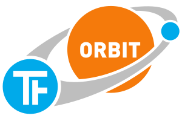

ORBIT
=====

ORBIT ist ein [Python][]-Framework für [TinkerForge][]-Anwendungen.

ORBIT ermöglicht die Entwicklung von dialogbasierten Systemen durch ein 
einfaches Konzept von Apps und Services. 
Es unterstützt eine robuste Anwendungsarchitektur durch wiederverwendbare 
Komponenten und die Entkopplung von Anwendungsteilen mit Hilfe eines 
Nachrichtensystem. 
Die Verwaltung der Verbindung zu TinkerForge-Bricks und -Bricklets übernimmt 
ein Gerätemanager, dadurch wird das Entwickeln von Anwendungen, 
die mit Verbindungsabbrüchen umgehen müssen, stark vereinfacht.

Eine ausführliche Dokumentation ist unter <http://mastersign.github.io/orbit/> zu finden.

ORBIT wird *nicht* von der [TinkerForge GmbH][TinkerForge] entwickelt, 
sondern ist ein unabhängiges Projekt von [Tobias Kiertscher][mastersign].

ORBIT wird unter der [LGPL-3.0][] zur Verfügung gestellt.

[Python]: https://www.python.org/
[TinkerForge]: http://www.tinkerforge.com/
[mastersign]: http://www.mastersign.de/
[LGPL-3.0]: http://opensource.org/licenses/LGPL-3.0
