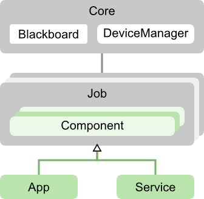
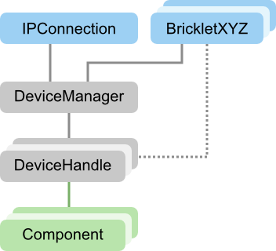
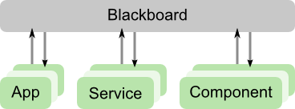
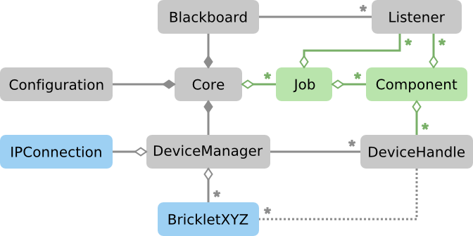

Architektur einer ORBIT-Anwendung
=================================

Eine ORBIT-Anwendung besteht aus einem Kern und assoziierten Jobs. 
Jobs können Dienste oder Apps sein. 
Die Dienste werden automatisch beim Start des Kerns aktiviert 
und sind gleichzeitig aktiv.
Von den Apps wird nur die Standard-App beim Start des Kerns akiviert
und zu jedem Zeitpunkt kann immer nur eine App aktiv sein.

Jobs werden aus Komponenten zusammengesetzt. 
Alle anwendungsspezifischen Fähigkeiten können in eigenen Komponenten
und Jobs implementiert werden.
Für einige Standardaufgaben bringt ORBIT fertige Komponenten und Jobs mit.

	Eine grobe Übersicht über die Architektur einer ORBIT-Anwendung

| *Siehe auch:*
| :py:class:`orbit.application.Core`,
| :py:class:`orbit.application.Component`,
| :py:class:`orbit.application.App`,
  :py:class:`orbit.application.Service`

Der Gerätemanager im Kern verwaltet die TinkerForge-Verbindungen und die angeschlossenen
Brick(let)s. Jede Komponente kann die Zuordnung von ein oder mehreren Brick(let)s eines 
Typs anfordern.
Dabei können auch UIDs von Brick(let)s als Einschränkung angegeben werden.
Sobald ein Brick(let) verfügbar ist, wird es den entsprechenden Komponenten zugeordnet
und die Komponenten werden über die Verfügbarkeit benachrichtigt. Wird eine Verbindung
getrennt, wird den Komponenten das Bricklet wieder entzogen.

	Eine Übersicht über den Gerätemanager

| *Siehe auch:*
| :py:class:`orbit.application.Component.add_device_handle`,
| :py:class:`orbit.application.DeviceManager`

Komponenten und Jobs können über ein integriertes, asynchrones Nachrichtensystem kommunizieren.
Das Nachrichtensystem ermöglicht eine weitgehende Entkopplung der Komponenten und Jobs 
von einander und sorgt für eine robuste Anwendung.

	Eine Übersicht über das Nachrichtensystem

| *Siehe auch:* 
| :py:meth:`orbit.application.Component.add_listener`,
  :py:meth:`orbit.application.Job.add_listener`,
| :py:meth:`orbit.application.Component.send`,
  :py:meth:`orbit.application.Job.send`,
| :py:class:`orbit.application.Blackboard`

Die folgende Übersicht stellt die wesentlichen Objekte in einer 
ORBIT-Anwendung und deren Assoziationen dar.
Grau hinterlegte Objekte werden von ORBIT implementiert. 
Blau hinterlegte Objekte werden durch die TinkerForge-Python-Bibliothek implementiert.
Grün hinterlegte Objekte werden anwendungsspezifisch implementiert,
wobei Basisklassen die die Implementierung erleichtern.

	Eine detaillierte Übersicht über die Architektur einer ORBIT-Anwendung
